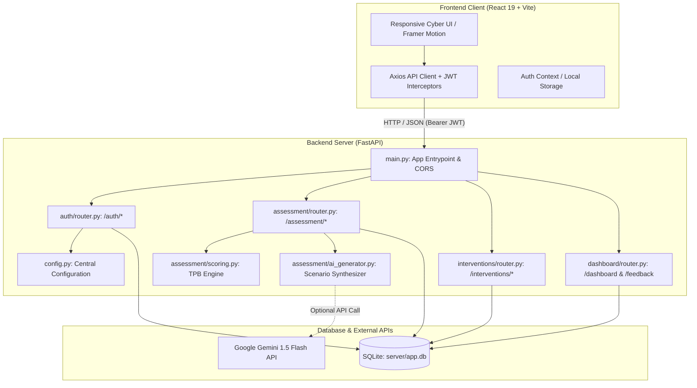
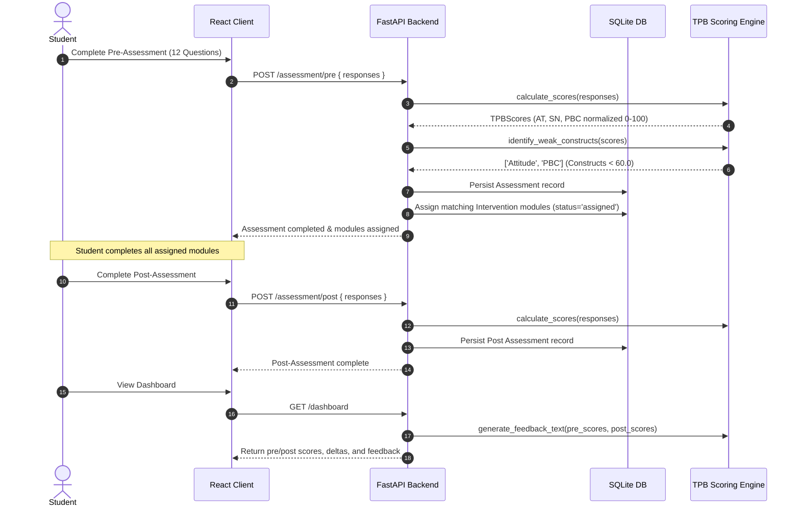
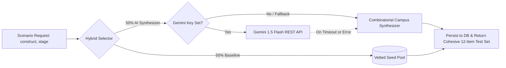

# TPB Cyberbullying Intervention System

> **A psychoeducational web platform grounded in the Theory of Planned Behavior (TPB) to assess, prevent, and mitigate cyberbullying among university students through tailored behavioral interventions and dynamic scenario synthesis.**

[](https://fastapi.tiangolo.com)
[](https://react.dev)
[](https://www.sqlalchemy.org)
[](https://www.python.org)
[](#license)

---

## Table of Contents

- [Project Overview](#project-overview)
- [Key Features](#key-features)
- [Theoretical Grounding (TPB)](#theoretical-grounding-tpb)
- [Architecture & System Workflows](#architecture--system-workflows)
  - [System Architecture](#system-architecture)
  - [TPB Assessment & Scoring Workflow](#tpb-assessment--scoring-workflow)
  - [Hybrid AI Scenario Generation Engine](#hybrid-ai-scenario-generation-engine)
- [Repository Structure](#repository-structure)
- [Getting Started](#getting-started)
  - [Prerequisites](#prerequisites)
  - [Backend Setup](#backend-setup)
  - [Frontend Setup](#frontend-setup)
- [Database Setup & Seeding](#database-setup--seeding)
- [Environment Configuration](#environment-configuration)
- [API Reference](#api-reference)
- [Screenshots & Demonstrations](#screenshots--demonstrations)
- [Future Improvements](#future-improvements)
- [License](#license)
- [Acknowledgements](#acknowledgements)

---

## Project Overview

Traditional cyberbullying countermeasures typically rely on post-hoc automated keyword detection, moderation queues, or punitive reporting after psychological distress has already occurred.

The **TPB Cyberbullying Intervention System** shifts the paradigm from reactive punishment to **primary psychological prevention**. Developed as a Senior Capstone Project at the Faculty of Computing, Riphah International University, the system evaluates university students' cognitive attitudes, perceived peer norms, and behavioral control thresholds. By identifying specific construct deficiencies, it dynamically prescribes interactive micro-interventions (readings, case studies, videos, and formative quizzes) to foster lasting digital empathy and constructive bystander intervention.

---

## Key Features

- 🔐 **Secure Role-Based Authentication**: Custom bcrypt password hashing with cryptographically signed HS256 JWT access tokens.
- 📊 **Psychometric TPB Assessment Engine**: Pre- and post-intervention evaluations measuring Attitude (AT), Subjective Norm (SN), and Perceived Behavioral Control (PBC) on normalized 0–100 scales.
- 🤖 **Hybrid Dynamic AI Generation**: Combines validated baseline psychometric scenarios with dynamic contextual synthesizers and optional Google Gemini 1.5 Flash API integration.
- 🎯 **Targeted Micro-Interventions**: Automatically assigns learning modules targeted directly at constructs falling below the empirical threshold ($Score < 60.0$).
- 📈 **Comparative Analytics Dashboard**: Interactive radar gauges, construct delta metrics ($Post - Pre$), completion tracking, and evidence-based personalized qualitative feedback.
- 📝 **Learner Feedback & Rating System**: Collects 5-star ratings and student reflections for assigned intervention modules.
- ⚡ **High-Performance Modern Stack**: Built with FastAPI and SQLAlchemy 2.0 on the backend, and React 19, Vite, and Framer Motion on the frontend.

---

## Theoretical Grounding (TPB)

The system operationalizes Icek Ajzen's (1991) **Theory of Planned Behavior**:

$$\text{Behavioral Intention} = f(\text{Attitude}, \text{Subjective Norm}, \text{Perceived Behavioral Control})$$

```
+-----------------------------------------------------------------------------+
|                                    TPB CONSTRUCTS                           |
+-----------------------------------------------------------------------------+
| 1. Attitude (AT)                                                            |
|    Measures student moral evaluations of digital cruelty and harassment.    |
|    Higher scores = strong recognition of harm and condemnation of bullying. |
|                                                                             |
| 2. Subjective Norm (SN)                                                     |
|    Measures perceived social and peer expectations against harassment.      |
|    Higher scores = strong belief that campus peers reject cyberbullying.    |
|                                                                             |
| 3. Perceived Behavioral Control (PBC)                                       |
|    Measures self-efficacy and confidence to intervene as an active upstander.|
|    Higher scores = strong readiness and knowledge to report or de-escalate. |
+-----------------------------------------------------------------------------+
```

### Psychometric Scoring Formula

Each scenario presents a calibrated 5-point Likert response scale ($1 = \text{pro-bullying / passive}$, $5 = \text{pro-social / active upstander}$). Raw construct averages are mapped to a standardized $0 - 100$ scale:

$$\text{Normalized Score} = \left( \frac{\bar{x}_{\text{raw}} - 1}{4} \right) \times 100$$

- **Empirical Weakness Threshold**: Any construct where $\text{Score} < 60.0$ triggers automated module assignment.
- **Fail-Safe Assignment**: If all construct scores exceed $60.0$, the student's lowest-scoring construct is assigned to encourage continuous mastery.

---

## Architecture & System Workflows

### System Architecture



### TPB Assessment & Scoring Workflow



### Hybrid AI Scenario Generation Engine



---

## Repository Structure

```
TPB 1.1/
├── .editorconfig              # Editor consistency rules (indentation, charset, EOL)
├── .env.example               # Full project environment template
├── .gitignore                 # Comprehensive version control exclusion rules
├── README.md                  # Professional project documentation
├── docs/
│   └── schema.sql             # Reference SQL schema definition
├── client/                    # Frontend Application (React 19 + Vite)
│   ├── .env.example           # Frontend environment template (VITE_API_URL)
│   ├── .gitignore             # Frontend-specific ignores
│   ├── index.html             # Single-page application root HTML
│   ├── package.json           # Node dependencies and scripts
│   ├── vite.config.js         # Vite bundler configuration
│   └── src/
│       ├── api/               # Centralized Axios client & API endpoints
│       ├── assets/            # Static assets and icons
│       ├── components/        # UI and cyber aesthetic components
│       │   ├── cyber/         # CyberBackground, ThreatGauge
│       │   └── ui/            # Badge, Button, Card, DataTable, Skeleton, EmptyState
│       ├── context/           # Global authentication state (AuthContext)
│       ├── pages/             # Route views (Landing, Login, Register, Assessment, ...)
│       ├── App.jsx            # Routing and application layout
│       ├── index.css          # Design system tokens and styling
│       └── main.jsx           # React DOM root entrypoint
└── server/                    # Backend API Application (FastAPI)
    ├── .env.example           # Backend environment template
    ├── config.py              # Centralized environment settings provider
    ├── database.py            # SQLAlchemy database engine and get_db session dependency
    ├── main.py                # FastAPI app initialization, middleware, and router mount
    ├── models.py              # SQLAlchemy ORM declarative models (8 tables)
    ├── schemas.py             # Pydantic v2 schemas and validation models
    ├── seed.py                # Idempotent database population script
    ├── requirements.txt       # Python backend dependencies
    ├── assessment/            # Assessment module
    │   ├── ai_generator.py    # Hybrid scenario generation engine
    │   ├── router.py          # /assessment/status, /pre, /post routes
    │   └── scoring.py         # TPB psychometric normalization and rule engine
    ├── auth/                  # Authentication module
    │   ├── router.py          # /auth/register, /login, /me, /profile routes
    │   └── utils.py           # Bcrypt password hashing and JWT bearer dependencies
    ├── dashboard/             # Dashboard and user reflection module
    │   └── router.py          # /dashboard and /feedback routes
    └── interventions/         # Psychoeducational interventions module
        ├── quizzes.py         # Interactive dilemma quiz banks
        └── router.py          # /interventions/my, /{id}/start, /{id}/complete
```

---

## Getting Started

### Prerequisites

- **Python**: Version 3.11, 3.12, or 3.13
- **Node.js**: Version 18+ or 20+
- **Git**

---

### Backend Setup

1. **Navigate to the server directory**:
   ```bash
   cd server
   ```

2. **Create and activate a Python virtual environment**:
   - **Windows (PowerShell)**:
     ```powershell
     python -m venv .venv
     .\.venv\Scripts\Activate.ps1
     ```
   - **Linux / macOS**:
     ```bash
     python3 -m venv .venv
     source .venv/bin/activate
     ```

3. **Install dependencies**:
   ```bash
   pip install -r requirements.txt
   ```

4. **Configure environment variables (Optional)**:
   ```bash
   cp .env.example .env
   ```

5. **Initialize and seed the database**:
   ```bash
   python seed.py
   ```

6. **Start the FastAPI development server**:
   ```bash
   uvicorn main:app --reload --port 8000
   ```
   The backend API will be available at `http://localhost:8000`.
   Interactive Swagger API documentation: `http://localhost:8000/docs`.

---

### Frontend Setup

1. **Navigate to the client directory**:
   ```bash
   cd client
   ```

2. **Install Node dependencies**:
   ```bash
   npm install
   ```

3. **Configure environment variables (Optional)**:
   ```bash
   cp .env.example .env
   ```

4. **Run the Vite development server**:
   ```bash
   npm run dev
   ```
   The frontend application will run at `http://localhost:5173`.

---

## Database Setup & Seeding

The application utilizes an SQLite database located at `server/app.db` (auto-generated, git-ignored).

### Database Schema

The database consists of 8 interconnected tables mirroring `docs/schema.sql`:

| Table | Description |
|---|---|
| `users` | Student credentials, CMS numbers, departments, and roles (`student`, `admin`). |
| `scenarios` | Psychological question bank categorized by TPB construct and evaluation stage. |
| `scenario_options` | 5-point Likert options (1–5) calibrated to pro-social behavior. |
| `assessments` | Per-user assessment records storing normalized construct scores (0–100). |
| `assessment_responses` | Granular question-by-question student selections. |
| `interventions` | Psychoeducational learning modules (`reading`, `video`, `quiz`, `case-study`). |
| `user_intervention_progress`| State tracking (`assigned`, `in-progress`, `completed`). |
| `feedback` | Student ratings (1–5 stars) and qualitative reflections on completed modules. |

### Running the Seed Script

To populate default psychometric items, intervention modules, and a test student account:

```bash
cd server
python seed.py
```

Default demo credentials created:
- **Email**: `demo@riphah.edu.pk`
- **Password**: `Demo1234!`

---

## Environment Configuration

| Variable | Description | Default / Example | Scope |
|---|---|---|---|
| `SECRET_KEY` | Secret key for signing HS256 JWT access tokens | `tpb-fyp-super-secret-key-change-in-prod-2024` | Backend |
| `ALGORITHM` | Cryptographic algorithm for JWT | `HS256` | Backend |
| `ACCESS_TOKEN_EXPIRE_MINUTES` | Token lifetime duration in minutes | `60` | Backend |
| `DATABASE_URL` | SQLAlchemy connection string | `sqlite:///./app.db` | Backend |
| `CORS_ORIGINS` | Comma-separated allowed frontend origins | `http://localhost:5173,http://127.0.0.1:5173` | Backend |
| `GEMINI_API_KEY` | Optional Google Gemini API key for dynamic scenarios | _Empty (uses built-in synthesizer fallback)_ | Backend |
| `VITE_API_URL` | Target FastAPI API base URL for Axios calls | `http://localhost:8000` | Frontend |

---

## API Reference

### Authentication (`/auth`)

| Method | Endpoint | Description | Auth Required |
|---|---|---|---|
| `POST` | `/auth/register` | Create a new student account | No |
| `POST` | `/auth/login` | Authenticate and obtain Bearer JWT | No |
| `GET` | `/auth/me` | Fetch authenticated student profile | Yes |
| `PATCH` | `/auth/profile` | Update student department / living situation | Yes |

### Assessment (`/assessment`)

| Method | Endpoint | Description | Auth Required |
|---|---|---|---|
| `GET` | `/assessment/status` | Check completion status and post-test unlock state | Yes |
| `GET` | `/assessment/pre` | Retrieve pre-intervention evaluation scenarios | Yes |
| `POST` | `/assessment/pre` | Submit responses, calculate scores, assign modules | Yes |
| `GET` | `/assessment/post` | Retrieve post-intervention evaluation scenarios | Yes |
| `POST` | `/assessment/post` | Submit post-assessment responses | Yes |

### Interventions (`/interventions`)

| Method | Endpoint | Description | Auth Required |
|---|---|---|---|
| `GET` | `/interventions/my` | List all assigned modules and completion status | Yes |
| `POST` | `/interventions/{id}/start` | Transition module status to `in-progress` | Yes |
| `POST` | `/interventions/{id}/complete` | Mark module `completed` and evaluate post-test unlock | Yes |

### Dashboard & Feedback (`/dashboard`, `/feedback`)

| Method | Endpoint | Description | Auth Required |
|---|---|---|---|
| `GET` | `/dashboard` | Aggregate pre/post scores, deltas, and progress | Yes |
| `POST` | `/feedback` | Submit 5-star rating and review for completed module | Yes |
| `GET` | `/feedback/my` | List all submitted feedback records | Yes |

---

## Screenshots & Demonstrations

<!-- Placeholders for project demonstration media -->
| Pre-Assessment Vignettes | Interventions Library |
|---|---|
| _[Screenshot: Interactive Likert Scenario]_ | _[Screenshot: Multimedia Micro-Modules]_ |

| Student Analytics Dashboard | Pre vs. Post Comparative Deltas |
|---|---|
| _[Screenshot: Threat Gauge & Progress]_ | _[Screenshot: TPB Construct Evolution]_ |

---

## Future Improvements

- 📱 **Native Mobile Application**: Cross-platform Flutter / React Native client for on-the-go student access.
- 🏫 **Institutional Analytics Dashboard**: Anonymized macro-level dashboards for university counselors and deans to identify campus climate trends.
- 🌐 **Multi-Language Support**: Urdu and localized dialect support for university demographics.
- 🔌 **LMS Integration**: LTI 1.3 standards compliance for seamless embedding into Canvas, Moodle, and Blackboard.
- 🐘 **Enterprise Database Support**: Native migration tooling (Alembic) for PostgreSQL and MySQL deployments in high-concurrency environments.

---

## License

This project was developed for academic and scientific research purposes as a Senior Capstone Project at the Faculty of Computing, Riphah International University. All rights reserved.

---

## Acknowledgements

- **Faculty of Computing, Riphah International University**: Academic guidance, supervision, and institutional support.
- **Icek Ajzen (1991)**: Foundational theoretical framework for the *Theory of Planned Behavior*.
- **Sameer Hinduja & Justin W. Patchin**: Seminal research on adolescent and collegiate cyberbullying dynamics.
- **Open-Source Community**: FastAPI, React, Vite, Framer Motion, and Lucide Icons.
